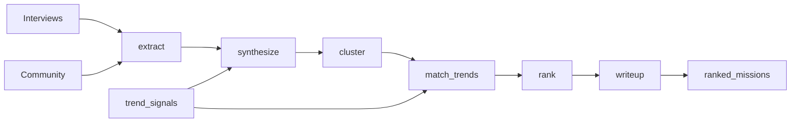

# Recommendation Engine

Turns **user interviews**, **community posts**, and **market trends** into a ranked list of SAP Experience Garage mission proposals — each with cited quotes, industry context, and an implementation-oriented write-up.

Built as a **LangGraph** weekly pipeline. Market trend **ingestion** lives in [`../Market_trends/`](../Market_trends/README.md); this repo reads enriched trends and user signals, then ranks and writes missions.

---

## What you get out

For each top mission:

- **Rank** and **final_score** (weighted sub-scores, re-tunable without re-running LLMs)
- **impact_score** and **effort_score** for prioritization narratives
- **related_trend_ids** linking to market validation
- **writeup** — five sections: Mission, Why This Matters, Industry Context, Suggested Approach, Risks

Synthesized solutions (from problem-only interviews) are tagged `llm_synthesized` so the UI can distinguish them from user-proposed ideas.

---

## System context

```
┌─────────────────────────────────────────────────────────────┐
│  UPSTREAM (other repos / jobs)                              │
├─────────────────────────────────────────────────────────────┤
│  Market_trends ingestion  →  enrichment  → gold.trend_signals│
│  Interview pipeline       →  bronze/interviews/             │
│  Community pipeline       →  bronze/community/                │
└──────────────────────────────┬──────────────────────────────┘
                               │
                               ▼
┌─────────────────────────────────────────────────────────────┐
│  THIS REPO — weekly LangGraph run                           │
│  extract → synthesize → cluster → match_trends → rank       │
│         → writeup → persist → gold.ranked_missions          │
└─────────────────────────────────────────────────────────────┘
                               │
                               ▼
                    FastAPI + `../frontend/` (rec-pilot-dash)
```

---

## Dashboard (API + UI)

Copy of **rec-pilot-dash** in [`../frontend/`](../frontend/README.md).

```bash
# API (:8000)
eg-api

# UI (:8080) — proxies /api to the backend
cd ../frontend && npm install && npm run dev
```

**Run Ranking** in the header calls `POST /api/pipeline/run`. Poll `GET /api/pipeline/status`; results at `GET /api/missions/ranked`.

---

## Pipeline stages

| # | Node | Input | Output |
|---|------|--------|--------|
| — | *(upstream)* | Bronze market JSONL | `gold.trend_signals` — **not** in this graph |
| 2 | `extract_node` | Interviews, community | Quote-grounded ideas; problem-only → next stage |
| 3 | `synthesize_node` | Problems + top-5 trends | 2–3 candidate solutions per problem (`llm_synthesized`) |
| 4 | `cluster_node` | All ideas + solutions | Embedding clusters + canonical statement |
| 5 | `match_trends_node` | Clusters | Related trends; alignment flags |
| 6 | `rank_node` | Clusters + trends | Scored missions (programmatic + LLM) |
| 7 | `writeup_node` | Top N missions | Five-section markdown proposals |
| — | `persist_node` | Full state | `silver.*` / `gold.ranked_missions` |



---

## Ranking (how scores work)

**Final score** is a weighted sum of nine parameters (defaults in [`src/recommendation_engine/config/ranking_weights.yaml`](src/recommendation_engine/config/ranking_weights.yaml)):

| Parameter | Weight | How |
|-----------|--------|-----|
| source_count | 0.20 | Programmatic — distinct interview + post sources |
| signal_urgency | 0.15 | LLM |
| market_validation | 0.15 | LLM — rising trends vs none |
| sap_relevance | 0.15 | LLM |
| source_diversity | 0.10 | Programmatic — entropy across source types |
| feasibility | 0.10 | LLM — 2–8 week prototype realistic? |
| recency | 0.05 | Programmatic — age decay |
| specificity | 0.05 | Programmatic — actionable vs vague |
| novelty | 0.05 | LLM |

**Derived axes** (for dashboards, not extra LLM calls):

- **impact_score** — average of source_count, urgency, market_validation, sap_relevance, novelty  
- **effort_score** — `1 − feasibility` (higher = more effort)

Change weights in YAML or SQL on stored sub-scores; no need to re-run the graph.

---

## Models

| Stage | Default model | Notes |
|-------|----------------|------|
| All LLM stages | `gemini-2.0-flash` | Override per stage via `EG_MODEL_*` |
| Idea extraction | `gemini-2.0-flash` | JSON schema via Gemini structured output |
| Trend enrichment | `gemini-2.0-flash` | Bronze → enriched trend signals |
| Embeddings | Databricks `databricks-gte-large-en` (1024-d) | `DATABRICKS_HOST` + PAT with **model-serving** scope; auto-fallback to Gemini embed on 403 |

Set `GOOGLE_API_KEY` (or `GEMINI_API_KEY`) from [Google AI Studio](https://aistudio.google.com/apikey). Configure models via `EG_MODEL_*` in `.env`.

---

## Data contracts

### Market trends (from Market_trends)

Bronze envelope (ingestion):

```json
{
  "source_id": "techcrunch_ai",
  "category": "news",
  "external_id": "...",
  "source_url": "https://...",
  "raw": { "title": "...", "summary": "..." }
}
```

This engine reads **`gold.trend_signals`** (enriched upstream):

```json
{
  "trend_id": "trend-agentic-rag-2026",
  "theme": "Agentic RAG for enterprise knowledge",
  "summary": "...",
  "evidence_urls": ["https://..."],
  "momentum": "rising",
  "embedding": [ ... ]
}
```

See fixtures: [`src/recommendation_engine/fixtures/mock_trend_signals.json`](src/recommendation_engine/fixtures/mock_trend_signals.json).

### Interviews & community (bronze)

| Path | Fields |
|------|--------|
| `bronze/interviews/dt=…/{id}.json` | `interview_id`, `participant_role`, `transcript`, `timestamp`, tags |
| `bronze/community/dt=…/{id}.json` | `post_id`, `author_role`, `body`, `upvote_count`, `timestamp` |

**Hybrid loading (typical dev setup):** interviews + market trends from **S3**; community from **fixtures** when `EG_COMMUNITY_SOURCE=fixtures`.

Edit mock posts: [`fixtures/mock_community.json`](src/recommendation_engine/fixtures/mock_community.json). Switch to real posts with `EG_COMMUNITY_SOURCE=s3`.

---

## Quick start (production — S3 + live APIs only)

No mock LLM, no mock embeddings, no fixture data in the CLI. Configure `.env` at **repo root** (`DAPL/.env`) or in `recommendation_engine/.env` (both are auto-loaded).

```bash
cd recommendation_engine
python -m venv .venv && source .venv/bin/activate
pip install -e ".[dev]"
```

Required in `.env`:

```bash
EG_LLM_MODE=live
GOOGLE_API_KEY=...
DATABRICKS_HOST=https://your-workspace.cloud.databricks.com
DATABRICKS_TOKEN=...
EG_EMBEDDING_PROVIDER=databricks
EG_DATA_SOURCE=s3
EG_ALLOW_FIXTURES=0
EG_S3_BUCKET=market-trend-exp2
AWS_PROFILE=eg-market-trends
```

**1. Ingest market trends** ([Market_trends](../Market_trends/README.md)) so bronze has JSONL on S3.

**2. Inspect S3:**

```bash
python -m recommendation_engine.main list-s3
```

**3. Run** (loads S3 → LLM-enriches bronze trends if gold is empty → full LangGraph pipeline):

```bash
python -m recommendation_engine.main run --output output/ranked_missions.json
```

**Unit tests** (patched APIs only — not a production path):

```bash
pytest
```

Example output fields:

```json
{
  "rank": 1,
  "final_score": 0.72,
  "impact_score": 0.68,
  "effort_score": 0.35,
  "related_trend_ids": ["trend-agentic-rag-2026"],
  "writeup": "## The Mission\n\n..."
}
```

### Production LLM run

```bash
# .env
EG_LLM_MODE=live
GOOGLE_API_KEY=...
DATABRICKS_HOST=...
DATABRICKS_TOKEN=...
EG_EMBEDDING_PROVIDER=databricks
LANGCHAIN_TRACING_V2=true
LANGCHAIN_API_KEY=...
```

---

## Configuration

| Variable | Purpose |
|----------|---------|
| `EG_DATA_SOURCE` | Must be `s3` for `run` |
| `EG_ALLOW_FIXTURES` | `0` in production; `1` only for pytest |
| `EG_ENRICH_BRONZE_TRENDS` | LLM-enrich bronze→trends when gold is empty (default `1`) |
| `EG_COMMUNITY_SOURCE` | `s3` or `fixtures` (mock community only; interviews always S3) |
| `EG_REQUIRE_USER_SIGNALS` | Fail if no interviews/community loaded (default `0`) |
| `AWS_PROFILE` | Named AWS credentials for S3 |
| `EG_LOOKBACK_DAYS` | Only read bronze partitions this recent (default 14) |
| `EG_MAX_MARKET_RECORDS` | Cap trend rows from bronze (default 200) |
| `EG_S3_GOLD_TREND_PREFIX` | Use enriched JSON here if available (`gold/trend_signals`) |
| `EG_LLM_MODE` | Must be `live` for `run` |
| `EG_MODEL_*` | Per-stage Gemini model IDs (default `gemini-2.0-flash`) |
| `EG_TOP_MISSIONS` | Write-ups generated for top N (default 10) |
| `EG_CLUSTER_COSINE_THRESHOLD` | Cluster merge threshold (default 0.85) |
| `EG_TREND_RETRIEVAL_K` | Trends retrieved per problem/cluster (default 5) |
| `EG_PIPELINE_CACHE` | `1` — disk cache + skip unchanged inputs (default on) |
| `EG_PIPELINE_FORCE_RERUN` | `1` — ignore cache and re-run full pipeline |
| `EG_PIPELINE_CACHE_DIR` | Cache root (default `recommendation_engine/.eg_cache`) |
| `DATABASE_URL` | Postgres + pgvector (optional; file cache used by default) |

Full list: [`.env.example`](.env.example).

---

## Project layout

```
recommendation_engine/
├── README.md
├── sql/schema.sql              # Postgres silver + gold DDL
├── src/recommendation_engine/
│   ├── graph/workflow.py       # LangGraph definition
│   ├── nodes/                  # One file per pipeline stage
│   ├── models/schemas.py       # Pydantic types
│   ├── llm/                    # Gemini client + prompts
│   ├── io/                     # Loaders, embeddings, store
│   ├── scoring/                # Programmatic rank features
│   └── fixtures/               # pytest only (EG_ALLOW_FIXTURES=1)
└── tests/
```

---

## Database

Apply [`sql/schema.sql`](sql/schema.sql) when RDS is ready:

- `silver.extracted_ideas`, `silver.candidate_solutions`
- `gold.idea_clusters`, `gold.ranked_missions`
- `gold.trend_signals` (written by enrichment job)

Results persist to **`recommendation_engine/.eg_cache/`** and, when `EG_PIPELINE_RESULTS_S3=1`, to S3 under **`bronze/gold/pipeline_runs/`** (the `market-trend-exp-bronze-writer` profile can only write `bronze/*`):

| S3 key | Contents |
|--------|----------|
| `bronze/gold/pipeline_runs/runs/{fingerprint}.json` | Full pipeline snapshot |
| `bronze/gold/pipeline_runs/latest_run.json` | Pointer to latest fingerprint |
| `bronze/gold/pipeline_runs/latest_ranked_missions.json` | Dashboard-shaped ranked missions |

Backfill after a prior run: `eg-recommend sync-s3` or `POST /api/pipeline/sync-s3`.

On **Run Ranking**, if inputs are unchanged, analysis loads from local cache or S3 — no LangGraph re-run. Set `EG_PIPELINE_FORCE_RERUN=1` to always recompute.

---

## Observability & audit

Each ranked mission stores: all sub-scores, `weights_version`, `prompt_version`, `trace_id`, `EG_GIT_SHA`.

Enable **LangSmith** via `LANGCHAIN_TRACING_V2` and `LANGCHAIN_API_KEY` for per-node traces (EU AI Act / reproducibility posture in the architecture plan).

---

## Related docs

- [Market Trends README](../Market_trends/README.md) — bronze ingestion and silver pipeline  
- Architecture plan — SAP Experience Garage Recommendation System (internal PDF)  
- [`sql/schema.sql`](sql/schema.sql) — table definitions  

---

## Roadmap (not yet implemented)

- [ ] Postgres persistence adapter  
- [x] S3 loaders for market bronze, interviews, community  
- [ ] FastAPI: `/missions/ranked`, `/missions/{id}`, `/explain/{id}`  
- [ ] LangSmith → S3 Parquet archive for compliance  
